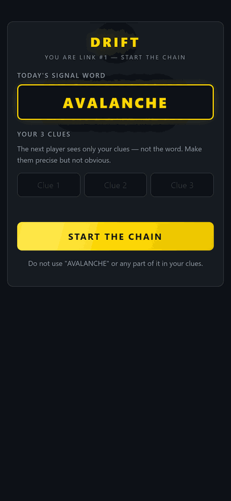
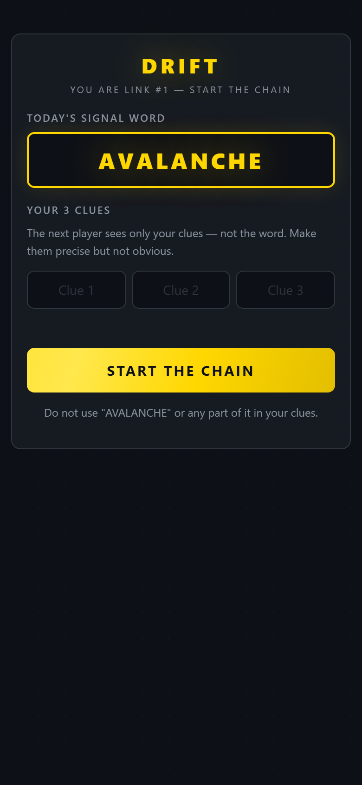
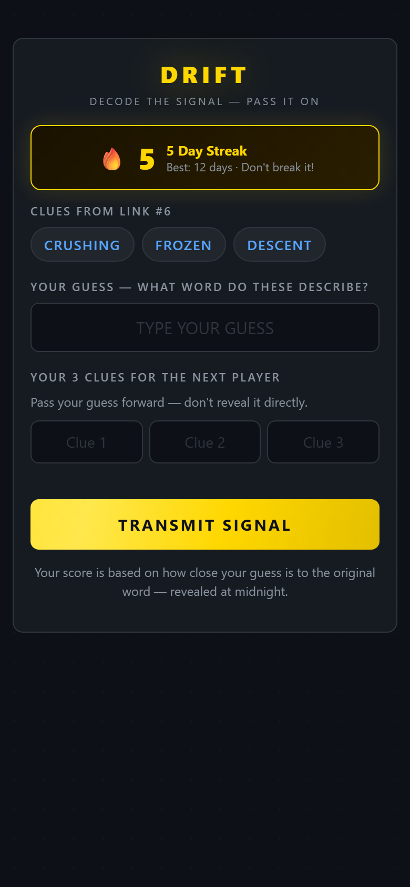
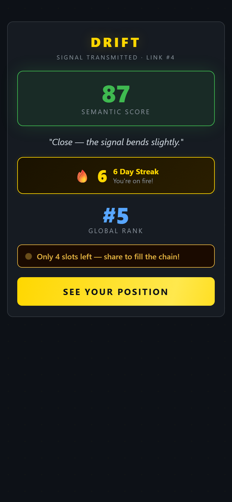
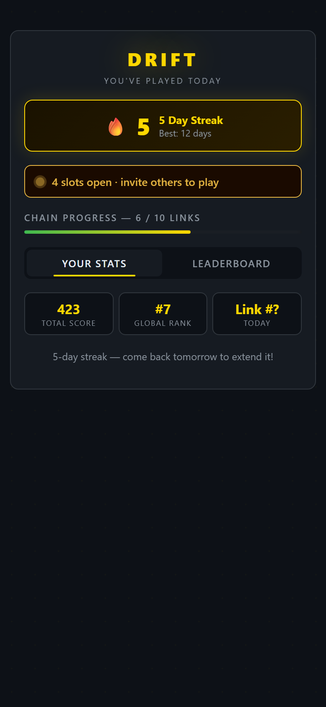
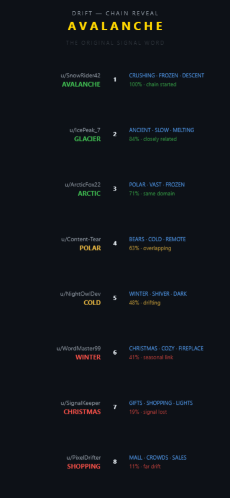

# DRIFT — Daily Word Telephone on Reddit

> *One secret word. Ten players. Each passes it forward using only 3 clues — never seeing the original. At midnight, the chain reveals: did the signal survive, or did it drift?*



---

## What is DRIFT?

Every day at midnight, DRIFT picks a secret word — something evocative like **AVALANCHE** or **NOCTURNAL**. The first player sees it and writes 3 clue words. The second player sees only those 3 clues, guesses the word, and writes 3 new clues from their guess. The chain passes through up to 10 community players.

**No player after Link #1 ever sees the original word.**

At midnight, the full chain reveals: every guess, every clue trio, every AI-scored semantic distance from the signal. You find out if your link held — or if you were the one who broke it.

---

## Screenshots

| First Player | Your Turn | Success |
|:---:|:---:|:---:|
|  |  |  |
| *Sees the secret word, writes 3 clues* | *Sees only clues, guesses + passes forward* | *Score counter, streak, global rank* |

| Waiting | Midnight Reveal |
|:---:|:---:|
|  |  |
| *Urgency bar, stats tab, leaderboard tab* | *Full chain with AI semantic scores, color-coded by drift* |

---

## The Hook

**You don't know if you won until midnight.**

That's it. That's the hook. You submit your guess and clues, see *"Signal transmitted. Link #4"*, and wait — all day. The chain is filling up around you. You can see it progressing — 6 links, 7, 8 — but you can't see anyone else's guesses. Just your own uncertainty, a streak counter you're scared to break, and the slow approach of midnight.

When the reveal hits, it's either euphoric:
> *AVALANCHE → GLACIER → ARCTIC → COLD — the signal barely drifted!*

...or humbling:
> *AVALANCHE → DESERT → HEAT → SUMMER → BEACH — yeah, that's on me.*

---

## How to Play

**If you are Link #1:**
- You see today's secret word
- Write 3 clue words that describe it (cannot use the word itself)
- Hit **START THE CHAIN** — your clues pass to the next player

**If you are Link #2–10:**
- You see only the previous player's 3 clues — never the original word
- Guess what word those clues describe
- Write 3 new clues based on *your guess*
- Hit **TRANSMIT SIGNAL** — your clues pass forward

**At midnight UTC:**
- The full chain reveals — every guess, every clue trio
- Each guess is scored 0–100 for semantic closeness to the original word
- See exactly where the signal drifted (and who broke it)

---

## AI Scoring

Each guess is scored by **Claude (claude-haiku-4-5-20251001)** for semantic distance from the original secret word in real time:

| Score | Meaning | Color |
|:---:|---|:---:|
| 90–100 | Near-synonym — signal held strong | 🟢 Green |
| 70–89 | Closely related — slight drift | 🟢 Green |
| 50–69 | Same domain — drifting | 🟡 Amber |
| 30–49 | Loose connection — signal weakening | 🟠 Orange |
| 0–29 | Unrelated — signal lost | 🔴 Red |

Scores are cached in Redis and visualized at midnight using Phaser 4 — color-coded arc rings around each chain node.

---

## Retention Mechanics

Five interlocking systems pull players back every day:

1. **🔥 Daily streak** — displayed prominently with fire count. Miss a day and it resets to zero.
2. **⚡ Urgency bar** — live slot counter (*"Only 3 slots left — signal fading fast"*) with an animated pulse dot.
3. **🏆 Global leaderboard** — Redis sorted sets rank all players by cumulative semantic score. Your rank is shown immediately after submission.
4. **🕛 Midnight reveal appointment** — the chain only reveals at midnight UTC. Daily return anchor, not just a reason to play once.
5. **📍 Position stakes** — knowing you're Link #4 in a 10-person chain means you feel responsible. If the word drifts, everyone sees it was your link.

---

## Tech Stack

| Layer | Technology |
|---|---|
| Platform | [Devvit Web](https://developers.reddit.com) v0.13.6 (Reddit Developer Platform) |
| Game Engine | [Phaser 4.2.0](https://phaser.io) — chain reveal with tweens, arcs, particles |
| Server | [Hono](https://hono.dev) on Devvit serverless Node.js |
| AI Scoring | [Claude claude-haiku-4-5-20251001](https://www.anthropic.com) via Anthropic API |
| Persistence | Devvit Redis — sorted sets for leaderboard, date-keyed chains |
| Scheduling | Devvit Scheduler — midnight reveal cron, daily post creation |
| Language | TypeScript throughout (client + server + shared types) |

---

## Architecture

```
Reddit Post (Phaser 4 canvas + HTML overlay)
    │
    ├── GET  /api/drift/state         ← chain state + player stats + leaderboard
    ├── POST /api/drift/submit        ← submit guess + clues, triggers Claude scoring
    └── GET  /api/drift/leaderboard   ← top 10 by cumulative score
    │
Devvit Server (Hono)
    ├── scorer.ts    ← Claude semantic scoring with Redis cache
    ├── dailyJob.ts  ← midnight reveal + daily post creation (cron)
    └── api.ts       ← game state, chain management, leaderboard sorted sets
    │
Devvit Redis
    ├── drift:daily:{date}:chain       ← JSON array of ChainLink objects
    ├── drift:daily:{date}:status      ← "revealed" flag (set at midnight)
    ├── drift:player:{u}:streak        ← current consecutive day streak
    ├── drift:player:{u}:best-streak   ← all-time best streak
    ├── drift:player:{u}:last-played   ← date key for streak calculation
    ├── drift:player:{u}:score         ← cumulative semantic score (all days)
    ├── drift:leaderboard              ← sorted set (member=username, score=pts)
    └── drift:config:api-key           ← Anthropic API key (moderator-set)
```

---

## Phaser 4 — Chain Reveal

The midnight reveal is rendered entirely in Phaser 4:

- **Staggered tween animation** — 10 nodes appear one by one at 220ms intervals
- **Semantic arc rings** — each node has a partial arc (0°→360° based on score) showing how close the guess was, colored green→amber→red
- **Ping burst particles** — expanding ring explosion fades out as each link appears
- **Ambient particles** — 16 floating gold dots create depth at all times
- **Adaptive canvas** — node size, fonts, and layout reflow for any iframe width from 320px to 900px
- **Camera drag scroll** — pointer-drag scrolls the canvas for long chains
- **Completion shake** — gentle camera shake when the final node lands

---

## Local Preview

The game includes a `?mock=` URL parameter mode for local development (no subreddit needed):

```bash
# Install and build
npm install
npm run build

# Start a local static server
node -e "
const http = require('http'), fs = require('fs'), path = require('path');
const dir = path.join(process.cwd(), 'dist/client');
const mime = {'.html':'text/html','.js':'application/javascript','.css':'text/css'};
http.createServer((req,res) => {
  let f = req.url.split('?')[0]; if (f=='/') f='/game.html';
  const fp = path.join(dir,f);
  if (!fs.existsSync(fp)) { res.writeHead(404); res.end(); return; }
  res.writeHead(200,{'Content-Type': mime[path.extname(fp)]||'text/plain'});
  fs.createReadStream(fp).pipe(res);
}).listen(4173, () => console.log('http://localhost:4173/game.html'));
"
```

Then open:

| URL | Screen |
|---|---|
| `http://localhost:4173/game.html?mock=first` | First player — sees secret word |
| `http://localhost:4173/game.html?mock=yourturn` | Your turn — sees clues, guesses |
| `http://localhost:4173/game.html?mock=success` | Success — animated score, streak, rank |
| `http://localhost:4173/game.html?mock=waiting` | Waiting — urgency bar + leaderboard |
| `http://localhost:4173/game.html?mock=reveal` | Midnight reveal — Phaser chain animation |

---

## Moderator Installation

1. Install from `https://developers.reddit.com/apps/drift-game`
2. Use the **"Create DRIFT post"** subreddit menu item to start today's chain
3. Add `api.anthropic.com` to **Domain Exceptions** in the developer portal
4. Activate Claude scoring — POST to `/internal/menu/set-api-key` with `{"key":"sk-ant-..."}`

The game works without the API key (string-match fallback scoring), but Claude scoring produces far richer semantic results.

---

## Scoring Formula

```
pointsEarned = semanticScore (0–100)
Link #1 always receives 100 points (chain starter)
Cumulative score = sum of all daily pointsEarned across all days played
```

---

## Project Structure

```
drift-game/
├── src/
│   ├── client/
│   │   ├── game.html          ← game iframe entry point
│   │   ├── game.css           ← full design system + animations
│   │   ├── game.ts            ← Phaser init + mock mode
│   │   ├── splash.html        ← Reddit post landing page
│   │   └── scenes/
│   │       └── Game.ts        ← all screens + Phaser reveal scene
│   ├── server/
│   │   ├── index.ts           ← Hono server entry
│   │   ├── routes/
│   │   │   ├── api.ts         ← /api/drift/* endpoints
│   │   │   └── menu.ts        ← moderator menu endpoints
│   │   └── services/
│   │       ├── scorer.ts      ← Claude semantic scoring
│   │       └── dailyJob.ts    ← midnight cron + date utilities
│   └── shared/
│       └── api.ts             ← shared TypeScript types
├── screenshots/               ← game screen captures
│   ├── demo.gif               ← animated demo
│   ├── 01-first-player.png
│   ├── 02-your-turn.png
│   ├── 03-success.png
│   ├── 04-waiting.png
│   └── 05-reveal.png
├── devvit.json                ← Devvit app configuration
├── package.json
└── README.md
```

---

*Built for the [Reddit's Games with a Hook Hackathon](https://devpost.com) · July 2026*
